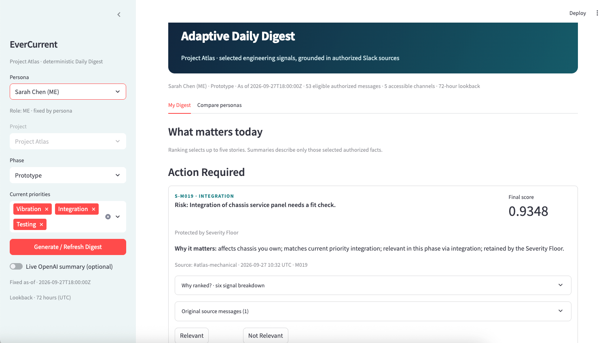
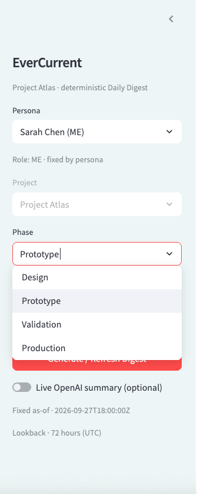
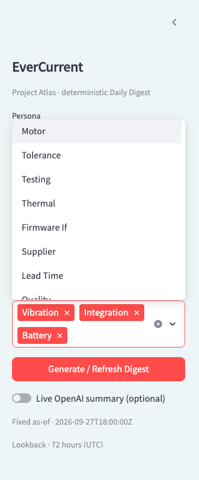
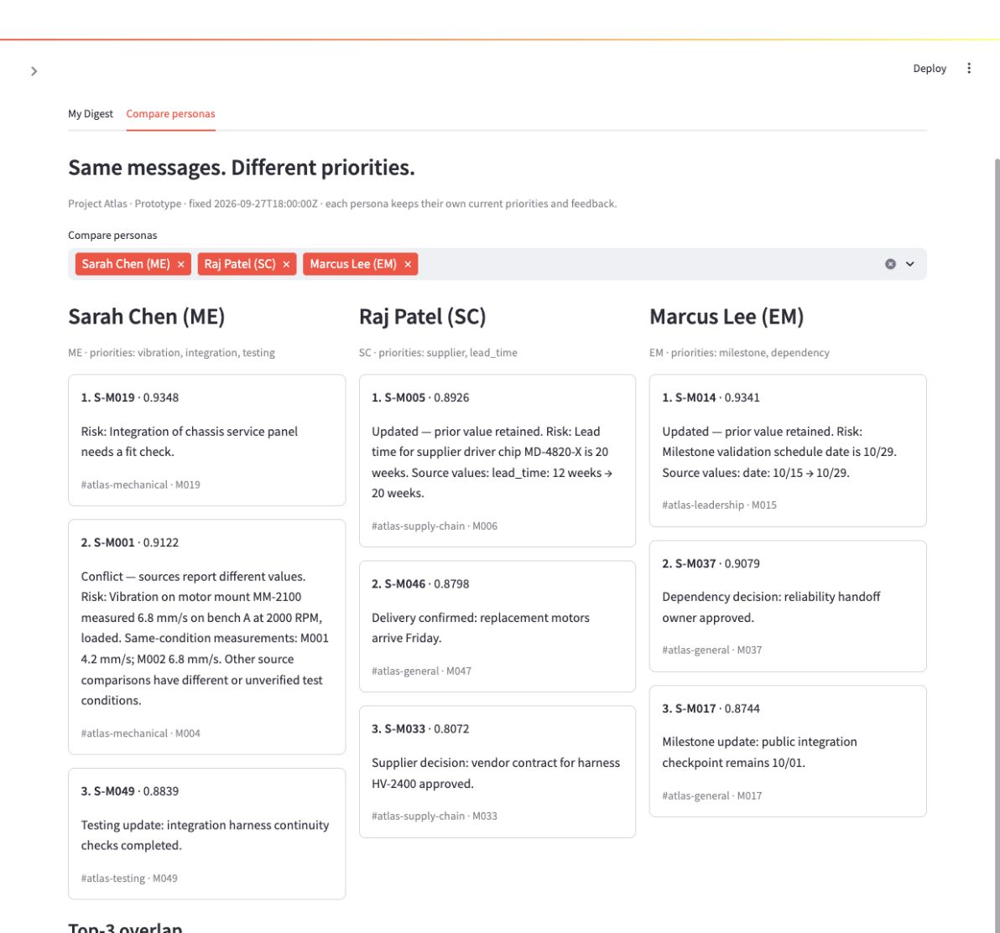
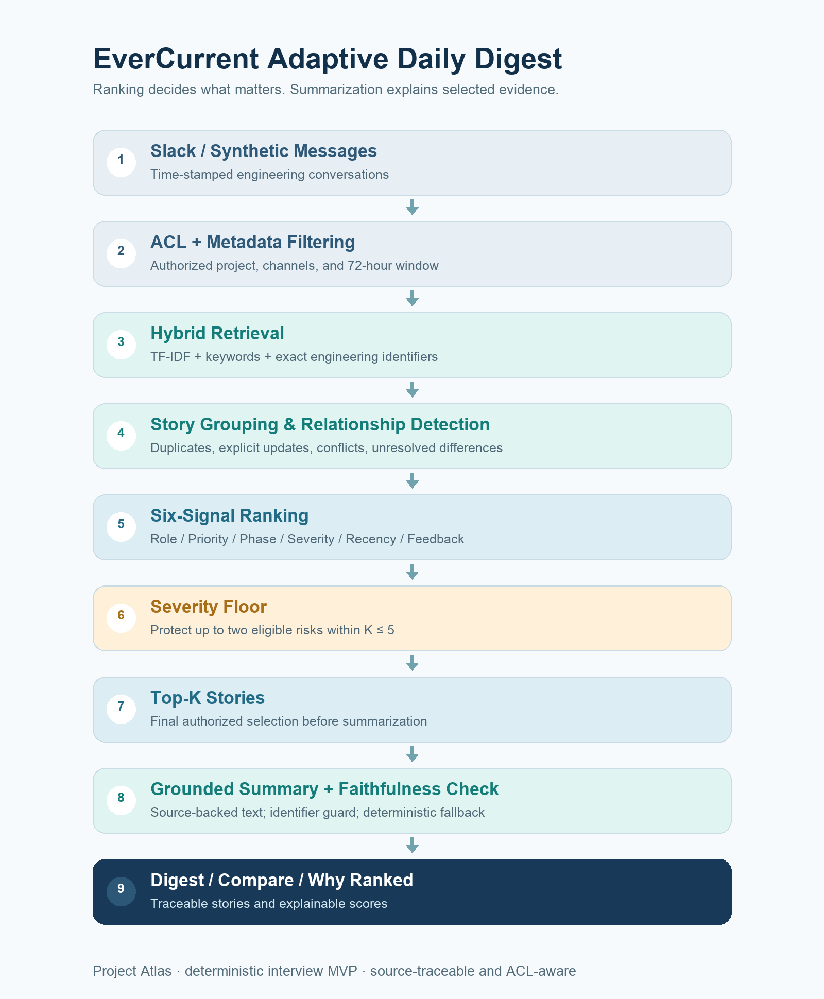

# EverCurrent Adaptive Daily Digest

EverCurrent Adaptive Daily Digest turns fragmented engineering Slack conversations into role-, phase-, and priority-aware daily updates. This interview MVP uses a fixed Project Atlas snapshot so a reviewer can reproduce the same decisions, inspect their sources, and compare what different team members see. It runs fully without an LLM API key.

## Why this problem matters

Hardware decisions are distributed across channels, threads, supplier updates, test logs, and project discussions. A mechanical engineer needs fit and vibration evidence; supply chain needs lead times and vendor commitments; engineering management needs schedule and cross-team dependencies. A single chronological summary misses those different decisions.

## Product Demo

The Streamlit MVP demonstrates how the same Slack conversations can be turned into different daily digests depending on **role, project phase, and current priorities**.

### 1. Digest home page

The main digest view surfaces up to five ranked stories for a selected persona. Each story is grounded in authorized source messages and includes explanation, traceability, and optional feedback.



### 2. Phase- and priority-aware controls

Users can change the **project phase** and current **priorities**, which changes what the system considers most important. The same engineering conversation may matter differently during Design, Prototype, Validation, or Production.

**Phase selection**



**Priority selection**



### 3. Compare personas

The compare view shows how the **same underlying Slack messages produce different top updates for different roles**. Sarah Chen (ME), Raj Patel (SC), and Marcus Lee (EM) each see information relevant to their responsibilities and current priorities.



Supporting captures show [Why ranked?](docs/screenshots/why-ranked.png), a [comparable conflict](docs/screenshots/conflict.png), and an [unresolved difference](docs/screenshots/unresolved-difference.png).

## Core design principle

**Ranking decides WHAT matters. The LLM decides HOW to summarize already selected information.** ACL, relevance, grouping, Severity Floor, and Top-K selection are deterministic. Optional model output never changes those decisions.

## Architecture



[Editable diagram source](docs/architecture.mmd). ACL and metadata filter the 72-hour pool before retrieval. Deterministic TF-IDF cosine candidate retrieval is unioned with keyword, priority, and exact-identifier hits. Related authorized messages are grouped; a six-signal score ranks stories; a Severity Floor can protect up to two eligible risks within the five-story limit. Only those final stories reach grounded summarization and identifier-level checking.

## Personalization

The Final Score uses Role **0.25**, Priority **0.25**, Phase **0.20**, Severity **0.15**, Recency **0.10**, and Feedback **0.05**. These configurable weights are **MVP hypotheses**, not learned optimal parameters. Role incorporates topic relevance and ownership; explicit current priorities expire after seven days; recency has a 48-hour half-life; feedback is persona-specific and decays with a seven-day half-life. **Why ranked?** shows the raw and weighted contribution of each signal. Severe eligible risks are considered from the full authorized pool before retrieval pruning and can replace lower-ranked unprotected items, never exceeding five slots.

## Retrieval and engineering differences

The default backend is **TF-IDF + cosine**, with metadata filtering and keyword/exact-priority/identifier union. The dataset has about 70 synthetic messages, so deterministic reproducibility matters more here than a model download. Similarity alone is unsafe for engineering facts: `24V` versus `48V`, `rev B` versus `rev C`, or `12 weeks` versus `20 weeks` can change a decision even when the text is nearly identical.

The system keeps **Duplicate** messages together, follows explicit **Superseded** update chains, and preserves different critical values. M001/M002 differ under the same stated conditions and are displayed as a conflict. M001/M003 use different RPM; M009/M010 and M012/M013 have different or insufficiently comparable conditions, so the UI says *Unresolved difference*. All authorized source evidence remains inspectable. Internal story relationship mechanics are intentionally conservative and are not a general fact-reconciliation engine.

## LLM usage

The summarizer receives only final authorized Top-K stories. It does **not** rank, decide ACL, or resolve conflicting engineering facts. Comparable conflicts and explicit update chains use deterministic summaries; single or duplicate stories can use an optional OpenAI provider. Summaries and cache entries are checked for source-supported engineering identifiers; invalid provider output falls back automatically. No key is needed for the default deterministic mode. This is identifier-level checking, **not full semantic hallucination detection**.

## Evaluation

All 20 baseline, five stress, and nine relationship-pair labels were human-reviewed and frozen before formal evaluation. Macro Precision@5 is **0.65** (minimum **0.40**, maximum **1.00**); **5 of 20** baseline scenarios fall below the original 0.60 target. Those misses are reported rather than changing the labels or ranking. Prototype Top-3 comparisons have nine of ten persona pairs below Jaccard 0.5; Marcus Lee (EM) and Lena Torres (PM) are **0.50** because milestone and dependency visibility appropriately overlaps. Every persona changes at least one Top-3 story from Prototype to Production. The [formal evaluation report](docs/EVALUATION.md) gives all 20 results, relationship checks, identifier faithfulness, and business explanations of the misses. The machine-readable result is in [`eval/results.json`](eval/results.json).

## Run locally

Tested with Python **3.13.5**. From the repository root:

```bash
python3 -m venv .venv
. .venv/bin/activate
python -m pip install -r requirements.txt
python -m streamlit run app.py
```

Open the local URL printed by Streamlit. To run regression tests and the offline evaluation:

```bash
python -m pytest tests/ -q
python eval/evaluate.py
```

Formal evaluation checks the approved ground-truth fingerprint before writing `eval/results.json`.

The app starts in no-key mode. The synthetic snapshot, configuration, and fixed UTC clock are included. No Slack account, database, or cloud service is required.

### Optional OpenAI mode

Set both environment variables before starting Streamlit:

```bash
export OPENAI_API_KEY="your-key"
export OPENAI_MODEL="a-model-available-to-your-account"
```

Then enable **Live OpenAI summary (optional)** in the sidebar. `.env.example` lists the variables but is not loaded automatically. The app has no hard-coded model default; if either setting is blank, it stays on deterministic summaries and explains why. This optional live path has **not** been end-to-end tested with a real credential.

## Limitations and next steps

This is a synthetic Project Atlas demo with rule-based enrichment, a small-corpus TF-IDF retrieval layer, identifier-level faithfulness only, session-only feedback, and no real Slack OAuth or Events API. The local JSON summary cache is a single-user demo convenience. Production work could add real Slack ingestion with freshness/retry controls, precomputed semantic retrieval and reranking, a persistent preference store, and evidence-driven learning-to-rank. None of those components is claimed as implemented here.

For a short walkthrough, see the [2–3 minute demo script](docs/DEMO_SCRIPT.md). The five written technical answers are available as [Markdown](docs/ANSWERS.md) and a [submission-ready PDF](docs/ANSWERS.pdf).
